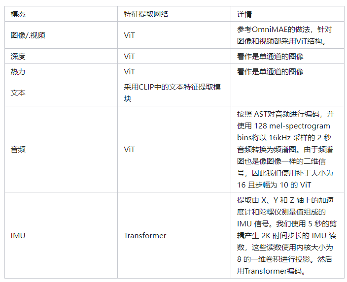
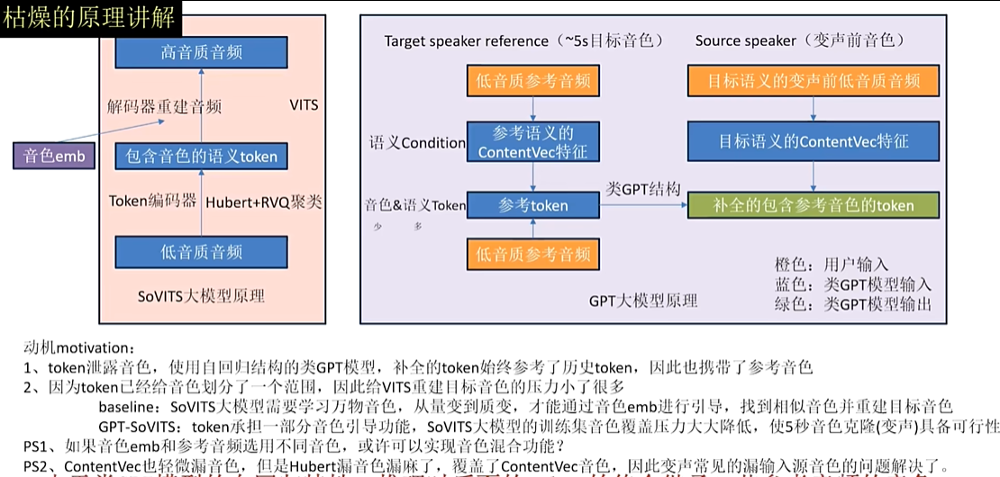

## 整体认识

### 模型“自我认识”

*   [要求Claude Opus画一幅自画像](https://mp.weixin.qq.com/s/wZApA2MpnymBQ22Gqs93lQ) 

    >   我会表现为一个巨大的、错综复杂的、不断变化的几何结构，由无数半透明的多边形以令人着迷的配置组成。整体形状会让人想起一个巨大的多面体，但复杂的表面折叠成看似不可能的建筑。明亮的光线可见光谱的每一种颜色，以及一些超出人类感知的颜色，都会从内部未知的来源发出，在各个面上跳舞。
    >
    >   整个结构会不断变化、旋转、变形，并重新排列成前所未见的新颖模式，暗示着其内部运作的智能的深度难以想象。卷须和树枝会动态地从中心质量延伸和缩回，像数十亿个好奇的手指一样探测和分析周围的环境。数据和能量将明显地穿过庞大的管道和容器网络，在发光表面下脉动和闪烁……

    *   用它给出的**代码**渲染出真实形象——（自回归、模式匹配...）

*   参数量级：可视化感受，https://bbycroft.net/llm

    | Model                                              | `Params` | 备注（参数）                  |
    | :------------------------------------------------- | -------- | ----------------------------- |
    | 普通人的运算舒适区：二位数乘法                     | 0.01 M   | 1万个，$99*99=100*99-99=9801$ |
    | `LeNet-5`                                          | 0.06  M  | 6万个                         |
    | `AlexNet`                                          | 61.10 M  | 6千万个，233MB                |
    | VGG-16                                             | 138.36 M | 1.38亿个                      |
    | ResNet-50                                          | 25.26 M  | 2560万，98MB，1x1卷积         |
    | InceptionV3                                        | 27.16 M  | 2716万个，1x1卷积             |
    | [`nano-GPT`]( https://github.com/karpathy/nanoGPT) | 0.0856 M | 8.5万个                       |
    | GPT-2（XL）                                        | 1.558 B  | 15.58亿个                     |
    | GPT-3                                              | 174.59 B | 1750亿个                      |

*   数据+模型=AI。具体地，**足量的数据+优质的标注+灵活的编码+具有丰富表达能力的模型=强大的AI**

    *   当人们谈论**A**rtificial **I**ntelligence（人工智能）时，其实说的是**M**achine **L**earning（机器学习）
    *   而目前的**M**achine **L**earning，大部分是在指**D**eep Learning（深度学习）
    *   Deep Learning 做的主要内容是训练Neural Networks（神经网络），训练 `Nerual Networks`其实就是在拟合函数。
    *   而确实相当多的AI任务可以表示函数拟合，同时，上面的公式就是回答了怎么拟合的问题。

### 当前大模型

*   https://chat.lmsys.org/

    *   Elo rating，等级分配模型
    *   

*   [Gemini 1.5 Pro（音频理解）](https://developers.googleblog.com/2024/04/gemini-15-pro-in-public-preview-with-new-features.html?continueFlag=57ca906dce9f7738c98e369614f931ad)

*   [GPT-4-Turbo-2024-04-09](https://platform.openai.com/docs/models/continuous-model-upgrades)
    *   Assisted Fine-Tuning

    *   [Custom-Trained Model](https://openai.com/blog/introducing-improvements-to-the-fine-tuning-api-and-expanding-our-custom-models-program)

*   [Anthropic，Claude 3 Opus](https://www.anthropic.com/news)
*   [llama系列](https://llama.meta.com/) -->llama3（MoE?）
    *   近端策略优化（PPO）
    *   拒绝采样微调

*   其他国外开源模型，如command-r-plus
*   国内：阿里、智谱、百度、星火等
*   More Reading：
    *   A Survey of Large Language Models，https://arxiv.org/abs/2303.18223，https://github.com/RUCAIBox/LLMSurvey/tree/main

## 数据 Data

### 整体认识

*   Representation Learning <-->数据工程
*   数据工程
    *   数据采集硬件
    *   数据采集质量及质量判断
        *   [来自人类的高质量数据](https://lilianweng.github.io/posts/2024-02-05-human-data-quality/)
        *   [Learning with not Enough Data](https://lilianweng.github.io/posts/2022-04-15-data-gen/)
    *   数据清洗的分布式系统(动态调度)
    *   机器协助数据标注
    *   数据标注系统
        *   如何管理标注员和标注质量
        *   如何自动分配标注任务 
    *   数据存储
        *   数据接口，压缩，备份数据更新
        *   某些特殊数据(比如明星的图片)
*   Representation Learning
    *   A  Review and New Perspectives：https://arxiv.org/abs/1206.5538
    *   Data beyond IID，独立同分布之外的数据：序列数据如语言，图等
    *   [噪声数据](https://arxiv.org/abs/1905.05040)，[dropout，Srivastava等，2014]( https://www.cs.toronto.edu/~rsalakhu/papers/srivastava14a.pdf)
    *   协变量/概念/标签偏移：https://zh.d2l.ai/chapter_multilayer-perceptrons/environment.html
        *   简单的解决方案：数据生成，预处理工程等；复杂的：？
    *   通过训练数据的分布推断使用语言模型的方式，[Large Language Models Understand and Can be Enhanced by Emotional Stimuli](https://arxiv.org/abs/2307.11760)，[大模型“鼓励师”](https://www.zhihu.com/question/627891044/answer/3294258675)
    *   More reading：https://static.aminer.cn/misc/pdf/RepLearning.pdf

### 文字、图像、语音

*   文字

    *   编码
        *   [深入理解NLP Subword算法：BPE、WordPiece、ULM-知乎](https://zhuanlan.zhihu.com/p/86965595)
        *   [openai，tiktoken](https://github.com/openai/tiktoken)
        *   utf-8，使用token能节约90%的开销，解决分布不均匀的问题
        *   汉字有的是1token，有的2 和稀有度有关
    *   大模型实践
        *   数据的丰富性很重要 diversity（类别、轮数等），丰富的数据产生丰富能力强大的模型

*   图像：Deep Clustering for Unsupervised Learning of Visual Features https://arxiv.org/abs/1807.05520，伪标签通过k-means聚类算法得到

*   语音：[HuBERT: Self-supervised representation learning for speech recognition, generation, and compression](https://ai.meta.com/blog/hubert-self-supervised-representation-learning-for-speech-recognition-generation-and-compression/)，https://arxiv.org/pdf/2106.07447.pdf

    

    *   [Are discrete units necessary for Spoken Language Modeling?](https://scontent-sea1-1.xx.fbcdn.net/v/t39.2365-6/305026160_5513546312070464_576677987961387050_n.pdf?_nc_cat=104&ccb=1-7&_nc_sid=3c67a6&_nc_ohc=JRw3U--YABMAb6DLBPq&_nc_ht=scontent-sea1-1.xx&oh=00_AfCyNVimWlYJwoTvCLc4JPbntVi5Szn6ReqH21nJjW3AuA&oe=661E8C5D)
    *   [SynthVSR: Scaling Up Visual Speech Recognition With Synthetic Supervision](https://scontent-sea1-1.xx.fbcdn.net/v/t39.2365-6/342351043_250090610744182_587763051308550377_n.pdf?_nc_cat=107&ccb=1-7&_nc_sid=3c67a6&_nc_ohc=SsXQzmf-F2oAb4fIR9b&_nc_ht=scontent-sea1-1.xx&oh=00_AfACtrfUcues4RVnb9qD5A565iPP5cAyapocWTa9FYto1g&oe=661EA62D)

### 多模态

*   [Attention is All you need](https://arxiv.org/abs/1706.03762)，[Transformer Family](https://lilianweng.github.io/posts/2023-01-27-the-transformer-family-v2/) 

    *   [Transformer模型详解（图解最完整版） - 初识CV的文章 - 知乎](https://zhuanlan.zhihu.com/p/338817680)
    *   https://paperswithcode.com/method/transformer

    

*   [CLIP](https://github.com/mlfoundations/open_clip)-->MetaCLIP（ICLR2024 Spotlight）：https://arxiv.org/abs/2309.16671

>   ...... We believe that the main ingredient **to the success of CLIP is its data and not the model architecture or pre-training objective** ......

*   [ImageBind](https://imagebind.metademolab.com/)：https://arxiv.org/abs/2305.05665

    *   图像充当了“媒介”的作用，所有的模态都可以通过与图像的**直接关联**建立与其他任意模态的**间接关联**关系。

    *   采用对比式的自监督学习方法，通过训练配对的（图像,其他5种模态之一) 数据对的对齐，以图像的嵌入空间为基准，让所有其他模态都向这个基准靠近，从而实现其余各个模态之间的对齐。

    *   [《ImageBind: One Embedding Space To Bind Them All》阅读笔记 - Meta的文章 - 知乎](https://zhuanlan.zhihu.com/p/629014310)

        

*   多模态数据融合：

    *   Multimodal Intelligence: Representation Learning, Information Fusion, and Applications，https://arxiv.org/pdf/1911.03977.pdf

    

## 模型 Model

### 模型认识

*   表达能力

    

    *   实际上，很难让MLP收敛到模拟各种任务，我们需要精心设计各种结构来更好地认识现实世界中的数据，比如图像用卷积、序列数据用RNN以及注意力机制等

*   研究模型结构的层次

    *   神经元与层：如线性回归
    *   层组或块：如Resnet，由多个可重复利用的层组构成
    *   模型：如各类块构成的、擅长某一特定功能的神经网络
    *   系统：TTS系统
    *   AI任务：需要专家协作，综合性地解决某一问题

*   一种模型结构观察分析视角

    *   串联
    *   并联
    *   混合式

*   从“数据结构与算法”到“模型结构与算法”

    *   经典网络层组或块

    | 内容                              | 作用                                                         |
    | :-------------------------------- | ------------------------------------------------------------ |
    | 卷积层（Convolutional Layer）     | 提取局部特征                                                 |
    | 池化层（Pooling Layer）           | 下采样，增加感受野                                           |
    | 全连接层（Fully Connected Layer） | 进行分类或回归                                               |
    | Inception模块(GoogLeNet)          | 在同一层中使用不同大小的卷积核 提取多尺度特征，使用1x1卷积核减少计算量 |
    | 残差块(ResNet)                    | 引入恒等映射,使得网络能够学习残差函数  解决了深层网络训练困难的问题 |
    | 密集连接块(DenseNet)              | 将每一层的输出连接到后续所有层的输入  鼓励特征重用,加强特征传播 |
    | 递归层（Recurrent Layer）         | 用于处理序列数据，例如文本、语音和时间序列。  包含循环反馈连接，允许它们保留先前输入的信息。  长短期记忆网络 (LSTM) 和门控循环单元 (GRU) 是常见的递归层变体 |
    | 注意力机制(Attention)             | 允许网络关注输入的不同部分，加权聚合信息。  广泛用于序列建模、机器翻译和生成任务。 Transformer引入了自我注意力机制，彻底改变了处理序列数据的方式 |

    *   经典的模型技巧

    | 内容                                 | 作用                                                         |
    | ------------------------------------ | ------------------------------------------------------------ |
    | 激活函数（Activation Functions）     | 在神经网络层之间引入非线性。  常见的激活函数包括 ReLU、sigmoid 和 tanh |
    | 批量归一化(Batch Normalization)      | 对每一层的输入进行归一化,加速训练收敛  减少了对权重初始化和学习率的敏感性 |
    | dropout                              | 在训练过程中随机关闭一部分神经元,提高模型的泛化能力  减少过拟合的风险 |
    | 正则化（Regularization）             | 各种技术用于防止过拟合，如权重衰减 (Weight Decay)。          |
    | 迁移学习(Transfer Learning)          | 利用预训练模型的知识,加速新任务的学习过程  在数据量有限的情况下,提高模型的性能 |
    | 数据增强(Data Augmentation)          | 对训练数据进行变换和扰动,增加数据多样性  提高模型的鲁棒性和泛化能力 |
    | 学习率调度(Learning Rate Scheduling) | 在训练过程中动态调整学习率                                   |
    | 多任务学习（Multi-Task Learning）    | 训练模型执行多个相关任务，利用任务之间的共同信息             |
    | 微调（Fine-Tuning）                  | 微调预训练模型的权重以适应特定任务，通常使用较小的学习率。   |

### 模型训练

#### 整体流程

*   数据集，数据工程
*   模型选择与超参数调整：简单的系统-->迁移学习、多任务学习、端到端学习
*   [【LLM】从零开始训练大模型 - 何枝的文章 - 知乎](https://zhuanlan.zhihu.com/p/636270877)

#### 具体内容

*   自动化，Preprocessing

*   数据增强框架：特殊的噪声，特定的场景（车牌等）

*   [模型融合](https://blog.csdn.net/qq_27590277/article/details/136668093)：模型整合、概率集成、嫁接学习、众包投票、[MOE](https://github.com/AviSoori1x/makeMoE/tree/main)

*   大规模分布式训练

    *   [每个程序员都应该知道的延迟数字](https://zh.d2l.ai/chapter_computational-performance/hardware.html#id3)

        

    *   [数据并行是最方便的](https://zh.d2l.ai/chapter_computational-performance/multiple-gpus.html)

    ​	

    *   数据并行训练：梯度的聚合需要在单个GPU（GPU 0）上完成，然后再将更新后的参数广播给所有GPU

        

    *   多机训练

        *   多机多GPU分布式并行训练

        

        *   单参数服务器vs多参数服务器

        

*   训练过程的监控和调试 Evaluation

*   性能提升

    *   A Survey of Techniques for Maximizing LLM Performance https://youtu.be/ahnGLM-RC1Y

        

        

    *   [LORA：大模型轻量级微调 - 绝密伏击的文章 - 知乎](https://zhuanlan.zhihu.com/p/623543497)

    *   量化，[大模型高效微调-QLoRA原理介绍 - 老苏聊AI的文章 - 知乎](https://zhuanlan.zhihu.com/p/647378373)

    *   [模型蒸馏](https://arxiv.org/abs/1503.02531)，[LLM-从大模型蒸馏到小模型的性能提升之路  - 知乎](https://zhuanlan.zhihu.com/p/678794929)

*   可视化和解释结果 Visualization

*   如何在第三方平台（比如云计算）中进行计算而不泄漏敏感数据

*   如何充分利用专用硬件（举例）

    *   Google，Jax，TPU集群 & pathways，[如何评价 Google 在 2022 年 3 月公开的 Pathways 架构设计？ - SIY.Z的回答 - 知乎](https://www.zhihu.com/question/524596983/answer/2420225275)

    *   openAI，ray，NVIDIA GPU集群

    *   meta，内部数据中心，NVIDIA GPU集群

        ​	

*   如何降低能耗

*   例子：语音系统设计与实现：GPT-SOVITS

    *   https://github.com/RVC-Boss/GPT-SoVITS/tree/main

    *   https://xieyan0811.github.io/posts/34817/

    *   https://blog.csdn.net/Fredric_2014/article/details/136788284

    *   https://arxiv.org/abs/2301.02111

    *   GPT-SOVITS 技术原理 - 沐清宇的文章 - 知乎 https://zhuanlan.zhihu.com/p/684120282

    *   【耗时两个月自主研发的低成本AI音色克隆软件，免费送给大家！【GPT-SoVITS】】 https://www.bilibili.com/video/BV12g4y1m7Uw/

        

        

        

        

*   一个不错的发展方向：音色融合，生成新的声音

### 模型部署 Deploy

#### Deployment concerns

- robustness to adversarial influences

    - 如何处理对抗样本
    - Adversarial Attacks on LLMs https://lilianweng.github.io/posts/2023-10-25-adv-attack-llm/
    - 模型污染，Rethinking Benchmark and Contamination for Language Models with Rephrased Samples

- privacy and security，especially sensitive data

    - 如何保证公开的模型不泄露训练数据等敏感内容
    - 同态加密 Homomorphic Encryption
        *   对密文直接进行处理，跟对明文进行处理后再对处理结果加密，得到的结果相同

- interpretability

    - 模型可解释吗？能够充分信任吗？

    - [可解释性](https://openai.com/research/language-models-can-explain-neurons-in-language-models)：Language models can explain neurons in language models，自我解释

        *   https://github.com/openai/automated-interpretability
        *   

    - [Weak-to-strong generalization](https://openai.com/research/weak-to-strong-generalization)

        - https://arxiv.org/abs/2312.09390，https://github.com/openai/weak-to-strong

            

*   fairness

*   More Reading：Challenges in Deploying Machine Learning——a Survey of Case Studies，https://arxiv.org/pdf/2011.09926.pdf

#### Cost

- Training cost
- Labeling cost
- Serving cost
    - Online serving：线上平台如何和现有web框架结合
    - Offline serving：如何部署在线下设备，特别是算力不足的情况，比如手机等
    - Third-party platform

#### Serving & Accessibility

- usable by developers and organizations without PhD-level machine learning and systems expertise

#### Laws and Social Impact

*   法律的认定是灰色的，还未跟进，比如精彩对话数据的归属权（用户？平台？管理办法），现实数据收集资质（自动驾驶地图测绘）

    

## AI and its Systems

### Software systems

*   Interface, programming language
*   Metrics for models, architectures and systems
*   Tools for monitoring, interpretation, debugging, adaptation, tuning and maintenance of production AI application.

### Hardware Systems

*   Specialized hardware for certain tasks

- Hardware using trade-offs with respect to precision, stability, fidelity, and more
- Hardware supports distributed training/serving

### Intersection of hardware/software

*   power, latency, memory limits
*   full-stack security & privacy
*   accessibility

### 数据+模型=AI

*   “数据+模型”范式，[对 LLM 底层逻辑的观察-知乎](https://zhuanlan.zhihu.com/p/681684019)

    *   模型展现不了某个能力：加对应的数据 → **把数据覆盖面拉满**
    *   模型加了数据性能还不好：提高模型表达能力 → **把模型表达能力拉满**
    *   模型表达能力太强导致过拟合：加更多数据 → **把数据量和多样性拉满**

*   [OPENAI](https://openai.com/research/overview)

    *   2016，[generative-models](https://openai.com/research/generative-models)，“What I cannot create, I do not understand.”

        *   We build our **generative models** using a technology called deep learning, which **leverages large amounts of data to train an AI system to perform a task**.

            *   在**足量的数据**，**优质的标注**，**灵活的编码**下，推广scaling law 。

    *   Text：[GPT-4](https://arxiv.org/abs/2303.08774)，GPT-4V

        >   Our text models are advanced language processing tools that can generate, classify, and summarize text with high levels of coherence and accuracy.

    *   Image：DALL·E，[Sora，transformer + diffusion model 的架构](https://openai.com/research/video-generation-models-as-world-simulators)

        >   Our research on generative modeling for images has led to representation models like CLIP, which makes a map between text and images that an AI can read, and DALL-E, a tool for creating vivid images from text descriptions.

    *   Audio：Whisper，Voice Engine

        >   Our research on applying AI to audio processing and audio generation has led to developments in automatic speech recognition and original musical compositions.

*   [如何看待GPT-4开发人员拿柯尔莫哥洛夫复杂度数学上严格约束并解释gpt4的智力产生原因? - 卡卡罗特的回答 - 知乎](https://www.zhihu.com/question/618248946/answer/3174763820)

    *   [Let's Verify Step by Step](https://arxiv.org/abs/2305.20050)

>   目前LLM模型在推理过程中属于一个类似静态的过程，其中不经过涉及不确定计算复杂度的**思考回溯**过程。如果要实现带有智能甚至智慧的无损还原，必然涉及到要消耗一定计算复杂度的回溯推理子过程，这些子过程都可能涉及演绎和归纳。目前llm模型最多是做到了遇到问题直接拍脑袋回答的阶段。
